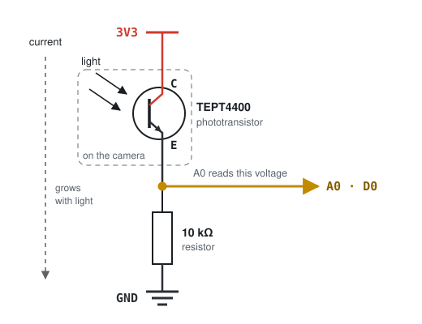
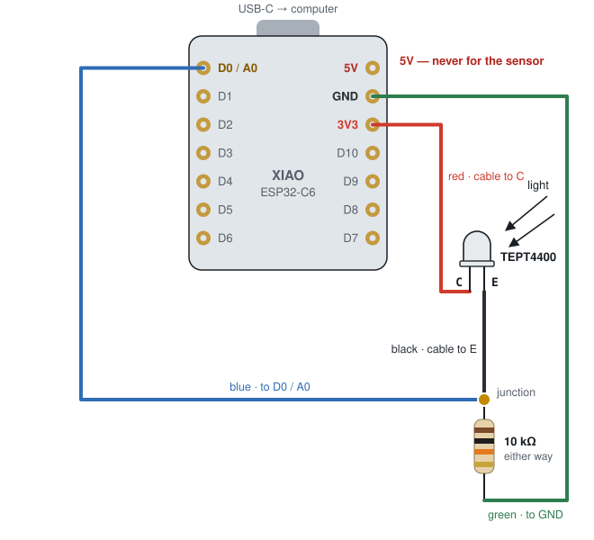
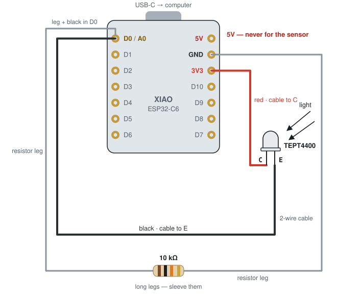

# Wiring and first tests

How to connect the TEPT4400 to a **Seeed XIAO ESP32-C6**, why the circuit works, and how to
check that the XIAO is healthy before soldering anything.

| Part | Role |
|---|---|
| Seeed XIAO ESP32-C6 | Reads the sensor; later reports to Home Assistant over Zigbee |
| TEPT4400 phototransistor (3 mm, 570 nm) | Lets current through when light falls on it |
| 10 kΩ resistor, ¼ W | Turns that current into a voltage the XIAO can measure |
| Two-wire cable, red + black | From the board to the sensor on the camera |
| Two short wires (layout A only) | Inside the enclosure — blue and green in the drawings; any colours will do |

---

## How the circuit works



The phototransistor sits out on the camera, inside the dashed box: the two wires crossing that
box are your **red and black cable**, red carrying 3V3 to the C leg and black bringing the E leg
back. Light lets current flow from 3V3 down through the phototransistor and the resistor to GND.
The more current, the higher the voltage at the junction, and that voltage is what A0
measures: about 0 V in the dark, rising towards 3.3 V in bright light. The resistor is drawn
as a box, the European symbol; American drawings use a zigzag.

| Light on the sensor | What A0 reads (roughly) |
|---|---|
| Covered with a finger | close to 0 |
| Normal room light | somewhere in between — depends on the room |
| Phone torch right up close | high, possibly the maximum (4095 raw, ~3 V+) |

### What the resistor is actually for

The phototransistor does not produce a voltage. Light makes it **conduct current** — think of
it as a tap that light opens, wider in bright light, almost shut in the dark. The XIAO's
analogue input does the opposite: it **measures voltage**, and draws practically no current
itself. So there is nothing for it to read yet.

The resistor is the converter between the two, and the whole of it is Ohm's law:

```
voltage = current × resistance        V = I × R
```

Every microamp the phototransistor lets through has to pass down through the 10 kΩ on its way
to GND, and pushing current through a resistance produces a voltage across it. That voltage,
right at the junction, is what A0 reads:

| Current through the sensor | Voltage at A0 across 10 kΩ |
|---|---|
| 10 µA | 0.1 V |
| 100 µA | 1.0 V |
| 330 µA and above | 3.3 V — the ceiling; brighter light can't push it higher |

**What happens without it?**

- Wire the E leg straight to A0 and nowhere else, and no current can flow at all: there is no
  path to GND. The pin is left "floating" and reads drifting nonsense — exactly what test 4
  shows with nothing connected. It's the same reason a digital input needs a pull-up or
  pull-down: an input with no defined path to a known level reads noise.
- Wire the E leg straight to GND instead, and current flows happily, but the voltage at that
  point is 0 V no matter how bright the light. Nothing to measure.

The two parts together make a **voltage divider**: 3V3 at the top, GND at the bottom, and the
reading in the middle. What makes it useful here is that the upper half changes with light
while the lower half stays fixed.

**The value sets the sensitivity.** More ohms means more volts per microamp:

- **47 kΩ** — reacts to dim light, but saturates at 4095 as soon as the LED is bright
- **10 kΩ** — a sensible start for an LED a few millimetres away in a shroud
- **2.2 kΩ** — needs plenty of light to move, but won't saturate

10 kΩ is a starting point, not a fixed truth. If the shrouded reading turns out to sit at the
ceiling whether the LED is on or off, go down; if it barely moves, go up.

One thing you don't need to worry about: heat. At these currents the resistor dissipates
around a microwatt (`P = I² × R`). Your ¼ W part is roughly 250 000 times over-specified — the
wattage you buy is about physical size and handling, not about this circuit.

In the finished project the sensor sits against the camera's LED in a dark shroud, so the
reading jumps when the LED switches on. Where to put the "LED is on" threshold is roadmap
step 3.

---

## Two ways to wire it — same circuit

Both layouts use the same three board pins and a **two-wire cable** to the sensor. The only
difference is where the junction is. The board is seen from the top, USB-C socket up.

### Layout A — junction in a splice



The cable's two wires go out to the phototransistor: **red** from 3V3 to its C leg, and
**black** back from its E leg to the junction. There the black wire, the resistor and a short
wire to D0 are joined in one splice. Two wires stay inside the enclosure: **blue** from the junction to D0 and
**green** from the resistor to GND. Those are simply the colours drawn here — any colours
will do.

### Layout B — resistor straight on the board



No splice, and no wires inside the enclosure at all. The resistor's legs go straight into the
**D0** and **GND** holes, and the cable's two wires go into **3V3** (red, to C) and **D0**
(black, to E). D0 holds two conductors, the resistor leg and the black wire, and that makes
the D0 hole itself the junction. The legs are long enough to fold the resistor out of the
way, but bare legs running over the board must be sleeved.

| | Layout A · splice | Layout B · on the board |
|---|---|---|
| Wires in the cable to the sensor | 2 | 2 |
| Board holes used | 3V3, GND, D0 | 3V3, GND, D0 |
| Conductors in the D0 hole | 1 | 2 — resistor leg + black cable wire |
| Loose splices to insulate | 1 three-way splice | none |
| Wires inside the enclosure | 2 — blue and green here | none — the resistor's own legs reach |

| Board pin | Where on the board | Layout A | Layout B |
|---|---|---|---|
| `3V3` | right side, 3rd from USB | cable red → C leg | cable red → C leg |
| `GND` | right side, 2nd from USB | green → resistor | resistor leg |
| `D0` (= A0) | left side, 1st from USB | blue → junction | resistor leg + cable black → E leg |

**In this cable, black is not ground.** It is the signal wire: it comes back from the
phototransistor's E leg and ends at D0. Ground is only needed inside the enclosure, where the
resistor's other end goes to the GND pin. Nothing in the two-wire cable connects to GND.

**Which leg is C and which is E?** The TEPT4400 datasheet's package drawing shows it. If
you're not sure, just try it: wire it one way and run test 5 below. If the reading doesn't
react to light, swap the two legs. The resistor limits the current to 0.33 mA, so the wrong
way round can't damage anything.

**Is it really 10 kΩ?** A four-band resistor reads *brown · black · orange · gold*. A
five-band one (often with a blue body) reads *brown · black · black · red · brown*.
Resistors work either way round.

> [!WARNING]
> **Three rules that protect the board**
> 1. **The sensor goes to 3V3, never to 5V.** Powered from 5V, the circuit can push more
>    than 3.3 V into A0, and that can permanently damage the pin. 5V and 3V3 are two pins
>    apart on the same side.
> 2. **Never connect 3V3 straight to GND.** They sit next to each other; a touching wire or
>    a solder blob between them is a short circuit. Check before you plug in.
> 3. **Change wires with the USB cable unplugged.** Connect first, then plug in.

---

## Testing the XIAO without soldering

Do these in order. Steps 1–4 need only a USB-C cable and one jumper wire, and together they
tell you whether the board works. Toolchain details — and where the functions in the sketches
come from — are in [firmware/](../../firmware/README.md).

> [!TIP]
> If the board is going into a slim enclosure, **don't solder the header pins** that come
> with it — they add several millimetres above and below the board. Solder the final wires
> straight into the holes instead.

### 0. One-time setup

- **Let your user talk to USB serial devices** (Debian/Ubuntu). Run this once, then log out
  and back in:
  ```sh
  sudo usermod -aG dialout $USER
  ```
- Install **Arduino IDE 2** from arduino.cc.
- **Tools → Board → Boards Manager**, search `esp32`, and install **esp32 by Espressif
  Systems**, version **3.0 or newer** — older versions don't know the C6. If it isn't listed,
  add this URL under **File → Preferences → Additional boards manager URLs**:
  ```
  https://raw.githubusercontent.com/espressif/arduino-esp32/gh-pages/package_esp32_index.json
  ```
- Choose **Tools → Board → esp32 → XIAO_ESP32C6**. **USB CDC On Boot** is *Enabled* by
  default on this board, which is what sends the board's messages up the USB cable — if the
  Serial Monitor stays empty, check that it hasn't been switched to *Disabled*.
- Use a USB-C cable that **carries data**. Many cables only charge: they light the board, but
  the computer never sees it.

### 1. Does the computer see it?

**Proves** that the chip gets power and its USB works. This is built into the chip itself, so
it works even if the board's program is broken, which makes it the most important test.

```sh
lsusb | grep -i 303a
ls /dev/ttyACM*
```

You should see:

```
Bus 001 Device 012: ID 303a:1001 Espressif USB JTAG/serial debug unit
/dev/ttyACM0
```

**If not:** try another cable first — that's the cause most of the time. Then another USB
port. Then *download mode*: hold the tiny **B** (BOOT) button beside the USB socket, plug the
cable in, and release. Still nothing after all three? The board is faulty.

A **red LED flickering or blinking** is normal. It's the battery-charge light, and with no
battery fitted it does that.

### 2. Can it run a program?

**Proves** that uploading works, and the processor, memory and USB messages all work.

Open [`firmware/tests/test2_alive`](../../firmware/tests/test2_alive/test2_alive.ino), pick
**Tools → Port → /dev/ttyACM0**, click **Upload**, then open **Tools → Serial Monitor** at
115200 baud. The yellow LED beside the USB socket blinks, and the monitor shows (the `rev`
number can be anything):

```
alive | ESP32-C6 rev 1 | 160 MHz | flash 4 MB | uptime 7 s
```

**If the upload fails:** put the board in download mode — hold **B**, tap **R** (RESET),
release **B** — and upload again; afterwards tap **R** to start the program. **If the LED
blinks but the monitor stays empty:** check *USB CDC On Boot → Enabled*, upload again, and
pick the port again. The board reconnects after an upload.

### 3. Does the radio work?

**Proves** that the 2.4 GHz radio and the antenna work. Wi-Fi and Zigbee share the same
radio and antenna on this chip, so finding your router here also covers the part of Zigbee
that can be broken in hardware.

Upload [`firmware/tests/test3_radio`](../../firmware/tests/test3_radio/test3_radio.ino). It only
listens and doesn't connect anywhere. Your own router a few metres away should show at around
−30 to −65 dBm:

```
scanning...
3 networks found
  YourNetwork                       -44 dBm  channel 6
  Neighbour_5G                      -78 dBm  channel 11
```

**If it finds 0 networks** while your phone, in the same spot, sees several: the radio or
antenna is faulty.

### 4. Can it measure a voltage?

**Proves** that the analogue input the sensor will use (A0) works. Upload
[`firmware/tests/test4_adc`](../../firmware/tests/test4_adc/test4_adc.ino); you need one jumper
wire.

- **Unplug USB.** Push the jumper wire's ends into the **D0** and **GND** holes, tilting each
  slightly so it presses against the metal ring. Plug in: the reading should be **about 0**.
- **Unplug,** move the GND end to **3V3**, plug in again: the reading should be **close to
  4095**, about 3000 mV or more.
- With nothing connected to D0 the numbers wander randomly. That's normal: an unconnected
  input "floats".

**If it reads 0 or 4095 no matter what,** check that the wire really touches the rings. If it
still does after that, the analogue input is faulty.

### 5. Optional: the real sensor, still without solder

**Proves** that the phototransistor and resistor work, and shows which leg is C. You need a
small breadboard.

- Push the header pins into the breadboard and **lay the XIAO on top of them without
  soldering**, pressing it down gently while you test.
- Wire it as in either layout above. On a breadboard layout B comes naturally: the resistor
  goes from the D0 row to the GND row. Run the test 4 program again, unchanged.
- Cover the sensor: the number drops. Shine a phone torch on it: it rises. No reaction at all?
  Swap the phototransistor's legs.

**If the readings jump when you touch the board,** that's the loose pin contact, not a faulty
XIAO.

---

## Keep it or send it back?

| What you see | What it means | Decision |
|---|---|---|
| Not in `lsusb` — with two data cables, two ports, and in download mode | dead board | return |
| Visible in `lsusb`, but uploading fails even in download mode | faulty board | return |
| Test 3 finds 0 networks while your phone sees them | radio or antenna fault | return |
| Test 4 reads the same fixed value whatever D0 touches | analogue input fault | return |
| Red LED flickers with no battery connected | normal charge-light behaviour | ignore |
| Tests 1–4 all pass | USB, processor, memory, radio and A0 all work | keep it |

---

## After the tests: solder the final connections

A wire or resistor leg pushed into a plated hole touches the metal ring only where it happens
to lean on it. Nothing springs it into place, the way a breadboard clip or a connector does.
That's fine for a few minutes of testing. Over weeks, a desk bump, a tug on the camera cable,
or a thin oxide layer on the copper turns it into a connection that opens and closes on its
own.

In this circuit every interruption looks like a real event. If GND breaks, A0 jumps high and
the LED seems *on*. If 3V3 breaks, A0 drops to zero and the LED seems *off*. If D0 breaks, the
pin floats and reads random numbers. Home Assistant would see the "busy" state flicker for no
reason, and no firmware can tell that apart from the real LED.

A solder joint doesn't move, so the only variation left is the analogue input's own small
noise, a few counts, which the firmware can average away. Soldering into plated through-holes
is also the easiest soldering there is.

**Zigbee comes next.** The XIAO can talk Zigbee, but Home Assistant also needs a Zigbee
*coordinator*, usually a small USB stick on the Home Assistant machine. The Arduino settings
for that (**Tools → Zigbee Mode → Zigbee ED (end device)** and a Zigbee partition scheme)
aren't needed for any of the tests above.
